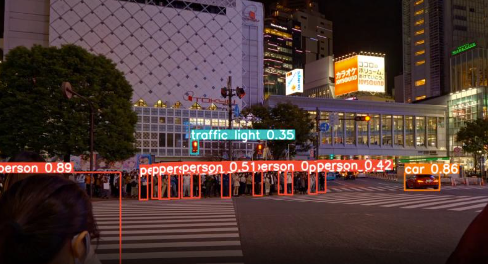

# Smart Blind Assistant

A computer vision-based smart assistant designed to help visually impaired individuals navigate traffic environments safely. This system uses object detection and speech synthesis to detect vehicles and traffic light colors in real-time from a video feed and provides audio instructions accordingly.

---

## Introduction

The **Smart Blind Assistant** leverages YOLOv8 for object detection and uses audio feedback to inform the user of traffic light colors and nearby vehicles. It interprets whether it's safe to walk or not based on the real-time analysis of traffic video footage.

---

## 📑 Table of Contents

- [Introduction](#-introduction)
- [Project Structure](#-project-structure)
- [Features](#-features)
- [Installation](#-installation)
- [Usage](#-usage)
- [Dependencies](#-dependencies)
- [Configuration](#-configuration)
- [Examples](#-examples)
- [Output Screenshot](#-output-screenshot)
- [Troubleshooting](#-troubleshooting)
- [Contributors](#-contributors)
- [License](#-license)

---

## 📁 Project Structure

The repository contains the following files and folders:

```
smart-blind-assistant/
├── Smart-Blind-Assistant.py     # Main script for traffic and object detection
├── video.mp4                    # Sample video input used for object detection
├── requirements.txt             # Python dependencies
├── README.md                    # Project documentation
└── assets/
    └── example_output.png       # Sample screenshot showing detection output
```

> The `assets/` folder contains visual examples from the project.  
> You can add your own screenshots if running the app in a different environment.

---

## Features

- Detects traffic lights and their colors (red, green, orange/yellow).
- Identifies nearby vehicles (car, truck, motorcycle, bus).
- Estimates vehicle proximity as *close* or *far*.
- Provides real-time voice feedback using text-to-speech.
- Adjustable speech timing interval to prevent overload.
- Easily extendable to real-time camera input.

---

## Installation

1. **Clone the repository:**

```bash
git clone https://github.com/omarsayah0/Smart-Blind-Assistant.git
cd smart-blind-assistant
```

2. **Set up a Python environment:**

```bash
python -m venv venv
source venv/bin/activate  # On Windows: venv\Scripts\activate
```

3. **Install the required packages:**

```bash
pip install -r requirements.txt
```

> If `requirements.txt` is not present, install manually:
> ```bash
> pip install opencv-python pyttsx3 numpy ultralytics
> ```

4. **Download YOLOv8 model:**
   The script automatically uses `yolov8n.pt`. If not present, it will be downloaded by `ultralytics`.

---

## ▶️ Usage

1. Make sure the following files are present in the project directory:
   - `Smart-Blind-Assistant.py`
   - `video.mp4` (input traffic footage)

2. Run the assistant:

```bash
python Smart-Blind-Assistant.py
```

3. Press `q` to quit the video window.

---

## Dependencies

This project requires the following Python libraries:

- OpenCV (cv2)
- pyttsx3
- Ultralytics YOLOv8
- NumPy

---

## Configuration

The following settings can be customized in the Python script:

| Setting         | Default Value | Description                                    |
|----------------|----------------|------------------------------------------------|
| `model.conf`   | 0.4            | Confidence threshold for object detection     |
| `model.iou`    | 0.5            | IOU threshold for non-max suppression         |
| `speech rate`  | 140            | Words per minute for speech output            |
| `speech interval` | 5–8 seconds  | Time between spoken alerts                    |

---

## Examples

Based on detected traffic light and nearby vehicle proximity, these are sample audio outputs:

- **Red light detected:**
  > 🗣️ "Wait, the traffic is red."

- **Green light and close car:**
  > 🗣️ "Wait, the traffic is green but a car is close."

- **Green light and no close car:**
  > 🗣️ "You can walk, the traffic is green."

- **Orange light:**
  > 🗣️ "Get ready, it's orange."

---

## 🖼️ Output Screenshot

Below is a sample output of the Smart Blind Assistant while detecting traffic lights and vehicles:



---

## Troubleshooting

| Issue                         | Solution                                                 |
|------------------------------|----------------------------------------------------------|
| `ModuleNotFoundError`        | Ensure all required libraries are installed              |
| Video doesn't load           | Confirm `video.mp4` is in the correct folder             |
| No audio plays               | Check TTS engine settings, reinstall `pyttsx3` if needed |
| Detection is inaccurate      | Use a higher precision model (e.g., `yolov8s.pt`)        |

---

## 👥 Contributors

- **Omar Alethamat** – *AI Engineer*

Feel free to open issues or pull requests to contribute.

---

## 📄 License

This project is licensed under the MIT License. See the [LICENSE](LICENSE) file for more details.
